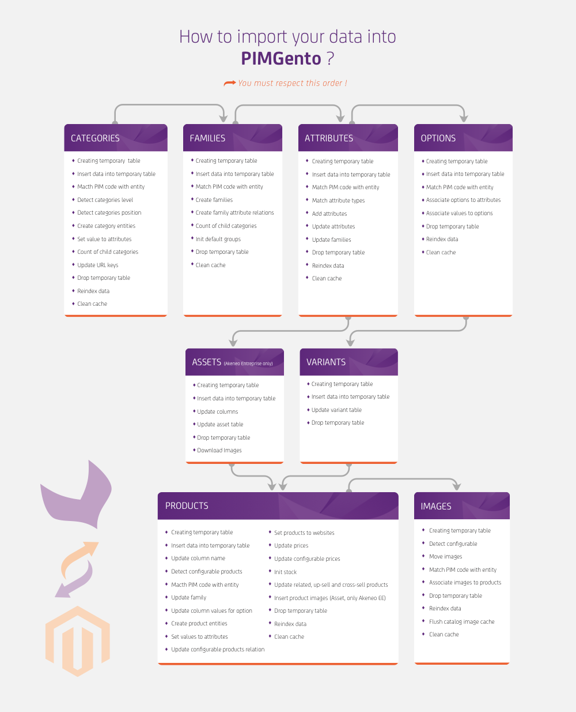

PIMGento Import
===============

About it:
---------

* PIMGento allow you to import quickly your catalog from Akeneo to Magento.

* PIMGento only accept csv files.

* To prevent errors due to missing data in Magento, you need to import your files in a specific order.

Import Order:
-------------
The following diagram is pretty straightforward for importing your data in order with PIMGento. You can skip steps, but be careful! For example, if you want to import attribute options and you have newly created attributes, if you don't import them before (even if you don't want to import this options for those missing attributes) it will result in an error. So check your data before importing it!

Technical stuff you should know about:
--------------------------------------

 Instead of handling the file line by line, PIMGento insert all the data from the file into a temporary table. Then data manipulation (mapping,...) is made within this temporary table in SQL. Finally modified content is directly inserted in SQL in Magento tables.

 Even if  raw SQL insertion is not the way you usually used to import data into a system, it is way more faster than anything else for the moment, especially with the volume of data you can have with a full Akeneo catalog. It results in a significant time saving in your import. PIMGento is from 10 to 20 times faster than API and native Magento import/export system thanks to that!