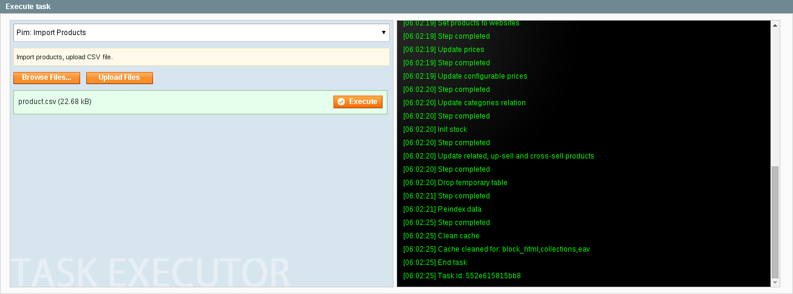

PIMGento Interface
==================

About it:
---------

* PIMGento Import Interface is located at Catalog > Import PIM data

* Select your import type from the dropdown list
* ***Browse Files...*** allow you to choose files from your computer
* ***Upload Files*** allow you to upload files on the server
* ***Execute*** launch the import

You can upload multiple files to PIMGento with the interface but you have to execute them manually one by one.

* Once you launch your import you can follow the import progress with the console.
##### DO NOT CLOSE THE BROWSER WINDOW WHILE THE IMPORT IS STILL ON!
* If an error popup, you can easily identify at which task the problem occured. You can check your logs files if you want further informations.

Technical stuff you should know about:
--------------------------------------

* Check your max_upload_size parameter (recommanded 8Mo for using PIMGento) of your php.ini before using Interface Import. If your files are too large, please use a [cron task](pimgento_cron.md) or the [cli](pimgento_cli.md) to import your data.
* If you opened your file before importing it in PIMGento, make sure you respect the integrity of the csv parameters (delimiter,...) and encoding (UTF-8).
